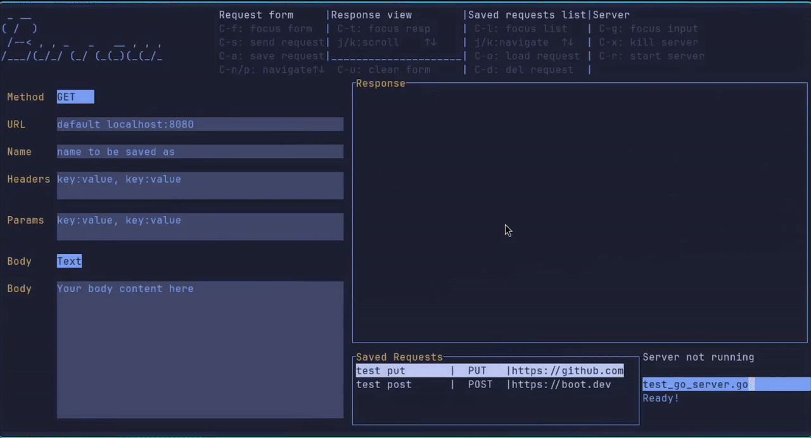

# Burrow

### A terminal-based HTTP client and go server manager for API testing.


## Overview
Burrow is a terminal-based client for managing and sending HTTP requests, as well as running and monitoring go servers.
Do like a gopher and cozy up in a burrow where you have all you need to develop your API directly from your terminal.

## Installation

### Go Install
```bash
go install github.com/ManoloEsS/burrow/cmd/burrow@latest
```

## Usage
### Quick start
- After installing, copy the `test_go_server.go` file in the test_server directory to any directory.
- `cd` to that directory and run `burrow`
- Use `Ctrl-G` to focus the server path input and type `test_go_server.go`
- Use `Ctrl-R` to start the server (make sure port 8080 is not being used)
- Use `Ctrl-S` to send a request, leaving all fields empty
- You'll see the response from the test server in the Response field

### Basic Commands

#### Request form
- Ctrl+F - Focus form
- Ctrl+S - Send Request
- Ctrl+A - Save request
- Ctrl+U - Clear form
- Ctrl+N/Ctrl+P - Navigate form fields

#### Response View
- Ctrl+T - Focus response
- J/K - Scroll text

#### Saved Request List
- Ctrl-L - Focus list
- Ctrl-O - Load request
- Ctrl-D - Delete Request
- J/K - Navigate list

#### Server Input
- Ctrl-G - Focus path input
- Ctrl-R - Start server 
- Ctrl-X - Kill server

- Ctrl-C - Close program

### General HTTP Client Usage
Burrow can be used as an API client similar to [Postman](https://www.postman.com/) or [Atac](https://github.com/Julien-cpsn/ATAC).
The added server functionality is meant to enable students and developers to easily run a go server and test it from the same environment.

The default port http requests are sent to with an empty url field is `8080`, so in order to test your server make sure it attaches to `localhost:8080` or modify the config file to your preferred port. 

The URL field can be used in the following ways:
```
somewebsite.com
http://somewebsite.com
https://somewebsite.com
```

URLs without a protocol part will be added `https://`

To send requests to local ports you can type:
```
:3030
# will send request to http://localhost:3030

:3030/foobar
# will send request to http://localhost:3030/foobar
```

For endpoints you can type the full URL or `/someendpoint`:
```
/foo
# Sends request to http://localhost:8080/foo (assuming 8080 is kept as default port)
```

### General Server Usage
Burrow will use the working directory where it was launched as the base for the relative path of the server path input.

If starting burrow in directory `home/app`, the input `server.go` will look for that file name in `./server.go`

To access the same file from a different directory you will need to input the absolute path: `home/app/server.go`

Currently Burrow only supports go servers.

## Configuration
Burrow uses XDG Base Directory Specification for file storage and supports YAML configuration files. The application works out-of-the-box with sensible defaults.

#### Configuration Priority
1. Config file: `~/.config/burrow/config.yaml` (if exists)
2. Environment variables: `DEFAULT_PORT`, `DB_FILE`
3. Sensible defaults: Port 8080, XDG paths for storage

#### File Locations
- **Config**: `~/.config/burrow/config.yaml`
- **Database**: `~/.local/share/burrow/burrow.db`
- **Logs**: `~/.local/state/burrow/burrow_log`
- **Server Cache**: `~/.cache/burrow/servers/`

#### Example Configuration
Copy `config.example.yaml` to `~/.config/burrow/config.yaml` and customize:

```yaml
app:
  default_port: "8080"
  # Default port to send http requests with empty url input

database:
  path: ""
  # Path to SQLite database file
  # Leave empty to use XDG default: ~/.local/share/burrow/burrow.db
```

#### Environment Variables
You can also set these values using environment variables:
 
DEFAULT_PORT - Override of default port (default: 8080)
DB_FILE - Override database path (default: ~/.local/share/burrow/burrow.db)  

You can override settings with environment variables:
```bash
DEFAULT_PORT=3000
DB_FILE=/tmp/mydb.db burrow
```

## Features
- Interactive TUI for building HTTP requests
- Support for GET, POST, PUT, DELETE and HEAD methods
- Requests can be saved to embedded SQLite database
- Start and stop go server files for development
- Built with [tview](https://github.com/rivo/tview)

## Requirements
- Go 1.25.1 or later (for building from source)
- Terminal with color support

## Development

### Building
```bash
git clone https://github.com/ManoloEsS/burrow.git
cd burrow
go mod tidy
go build -o burrow cmd/burrow/main.go
```

**Note**: Requires CGO to be enabled and a C compiler for SQLite integration.

## Future features
- Functionality for diverse body types in requests
- Functionality to run server files with different langugages (python, javascript)

## Contributing
Contributions are welcome!

## License
MIT License

## FAQ

**Q: Who is this program for?**
A: This program is meant to be used by students and developers that work with go servers.

**Q: I'm not a neovim user, can I navigate with my mouse?**
A: Yes, burrow is designed to be fully keyboard-driven, however tview offers mouse support as well.

